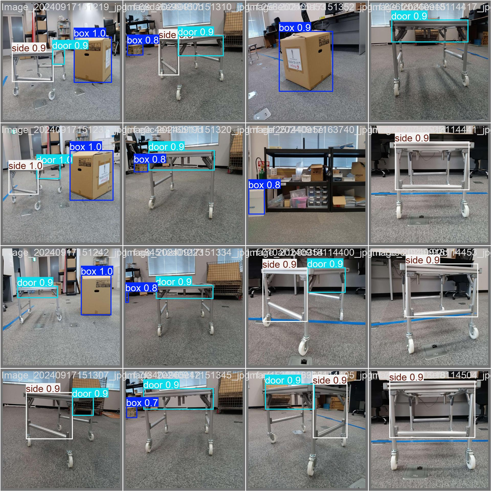

# Training YOLOv8 for detection

This is a guide to help user utilize YOLOv8 AI model to detect object, which in our case would be the charging dock of KEIGAN Ali by KEIGAN co. limited. More information on the project is written in NOTE.md

## Installation

Use the package manager [pip](https://pip.pypa.io/en/stable/) to install ultralytics. The library required OpenCV: 4.20.0 or more, and Python: 3.9 or more.

```bash
pip install ultralytics
```
## Preparing Database

[Roboflow](https://app.roboflow.com) is a example of an annoation tool . This website is especially 
recommended because of the abilty to turn the database into a ready to use YOLOv8 format. Also its very easy to use and divide work amongst fellow worker.

```python
!pip install roboflow

from roboflow import Roboflow
rf = Roboflow(api_key="***************")
project = rf.workspace("Workplace").project("DockingObjDet")
version = project.version(9)
dataset = version.download("yolov8")
```

I put both rawdata and annotated data into the datasets folder.
## Training

We load a pretrained YOLOv8 middle size object detection model as a base model. While training the data, we set to freeze ten layer each epoch to not introduce too much instances at once and changing the model too much, whcih would cause it to lose the ability to detect object accurately. 

```python
from ultralytics import YOLO

# Load a model
model = YOLO("yolov8m.pt") #Desired pre trained model. The size increases from n < s < m < l

# Train the model   
train_results = model.train(
    task = "detect",
    data=" ",  # path to dataset YAML
    epochs=100,  # number of training epochs
    imgsz=640,  # training image size
    freeze = 10,
    lr0 = 0.005,
    device="cpu",  # device to run on, i.e. device=0 or device=0,1,2,3 or device=cpu
)
```
The training of the training can be view in the train folder. To improve our model, a more variety of data in the dataset is a must. Alongwith, including more images from different anlge, distance, lightning, etc. The trained model (.pt) is kept in the train/weight folder, but for the sake of simpleness, I put the model in the main folder.

## Validation
The following code is used to validate the model. The validation results can be view from the validation folder.
```python
# Evaluate model performance on the validation set
metrics = model.val()
```

## Usage

The predict function is use to utilize our model on an image or a video.
```python
# Perform object detection on an image
results = model.predict("Enter path to video or image",show =True, save=True)
results[0].show()
```
To use it with live inference, we use it with OpenCV as the following code.

```python
# Open the webcam (laptop camera)
cap = cv2.VideoCapture(1)

if not cap.isOpened():
    print("Error: Could not open video stream.")
    exit()

while True:
    # Read frame from the webcam
    ret, frame = cap.read()
    if not ret:
        break
    
    # Get the frame dimensions
    frame_height, frame_width = frame.shape[:2]
    
    # Perform object detection with YOLOv8
    results = model(frame)
    
    # Parse results
    for result in results:
        boxes = result.boxes.xyxy.cpu().numpy()  # Get bounding boxes
        confs = result.boxes.conf.cpu().numpy()  # Get confidence scores
        classes = result.boxes.cls.cpu().numpy()  # Get class IDs
        #print(f"classes list: {classes}") #Check number of element in detected classes
        # if len(classes) > 0:
        #     print('Object detected')
        # else:
        #     print('not detected')
        for box, conf, cls in zip(boxes, confs, classes):
            # Extract coordinates
            x1, y1, x2, y2 = map(int, box)
            
            # Draw bounding box around the object
            cv2.rectangle(frame, (x1, y1), (x2, y2), (0, 255, 0), 2)

            # Put the class, confidence, distance, and alignment status text on the frame
            class_name = model.names[int(cls)]
            label = f"{class_name} {conf:.2f}"
            cv2.putText(frame, label, (x1, y1 - 20), cv2.FONT_HERSHEY_SIMPLEX, 0.5, (255, 0, 0), 2)
    # Show the frame
    cv2.imshow('YOLOv8 Object Detection with Angular Offset', frame)
    
    # Break the loop on 'q' key press
    if cv2.waitKey(1) & 0xFF == ord('q'):
        break

# Release the capture and close the windows
cap.release()
cv2.destroyAllWindows()
```

## Results



## References
Getting help or more information on this topic can be done on the [ultralytics](https://docs.ultralytics.com/) main website which have more detail than you need. Or if you have any question to who in there damn mind wrote this code, you can contact me at rattanasiwamok.mingkwan.63y@st.kyoto-u.ac.jp :
